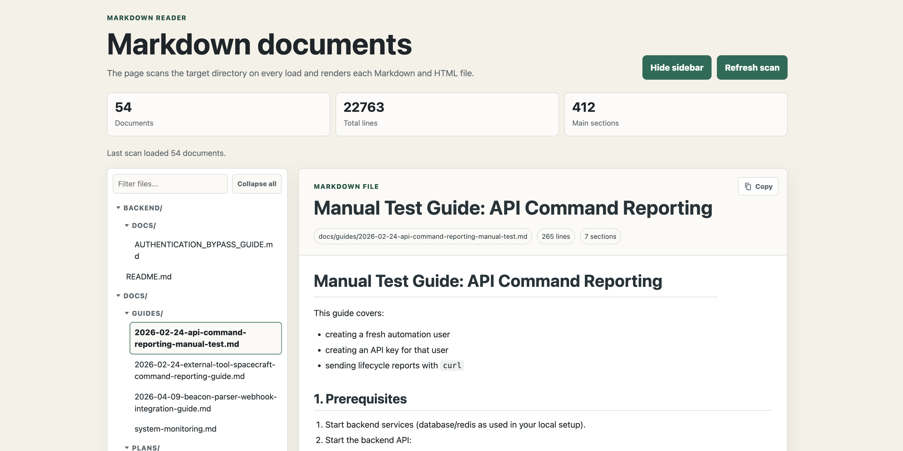

# markview

A Claude Code plugin that serves a directory's markdown and HTML files as a browsable, styled reading experience in your browser.

Ask Claude to "preview the markdown files here" (or run `/markview:start`) and it spins up a tiny local web server with a sidebar listing every document in the directory, rendered with clean typography.



## Features

- **Rendered markdown** — GitHub-flavored markdown via a vendored copy of [marked](https://github.com/markedjs/marked), sanitized with [DOMPurify](https://github.com/cure53/DOMPurify)
- **HTML files too** — `.html` files are listed and rendered alongside markdown
- **Sidebar navigation** — recursive scan of the target directory (skips `node_modules` and dot-directories), with a hide/show toggle
- **Copy source** — one click to copy a document's raw source
- **Zero dependencies** — Node.js built-ins only; nothing to `npm install`
- **Local only** — binds to `127.0.0.1`, picks the next free port if 4173 is taken, and rejects path traversal outside the served directory

## Requirements

- [Claude Code](https://claude.com/claude-code)
- Node.js ≥ 18

## Installation

In Claude Code:

```
/plugin marketplace add vicmpen/markview
/plugin install markview@markview
```

## Usage

Just ask Claude naturally:

> preview the markdown files in this directory

Or use the slash commands:

| Command | What it does |
|---|---|
| `/markview:start [dir]` | Start the server for `dir` (defaults to the current directory) and open the viewer |
| `/markview:stop` | Stop all running markview servers |

Each invocation targeting a different directory starts its own instance on its own port.

## Development

Run the test suite (no setup needed):

```
node --test tests/server.test.mjs
```

## License

[MIT](LICENSE)
